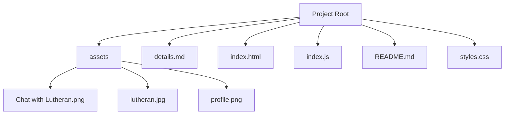

# 프로젝트 목표
- ChatGPT API를 활용하여 루테란의 성격과 대화 스타일을 구현한 대화 모델을 개발.
- 개발된 내용에 대해 문서화 및 배포.

# 프로젝트 계획 및 준비

### 요구사항 분석
1. 로스트아크의 배경과 루테란 분석 
    - 로스트아크 스토리 진행도 [상세 설명](details.md#로스트아크-스토리-진행도)
        | 스토리 | 엔드 컨텐츠 |
        |-|-|
        | 쿠르잔 북부 | 카제로스 레이드 1막 |

    - 루테란의 과거 및 현재 행적 [상세 설명](details.md#루테란의-과거-및-현재-행적)
        - 과거부터 지금까지 항상 언급되었지만 최근 작중 행적이 플레이어와 매우 가깝거나 직접 개입.

2. ChatGPT API의 기능과 제한사항을 이해
    - 기능
        - 자연어로 사용자와 대화가 가능하며 자연스럽고 일관된 대화 흐름 유지.
        - 사용자의 질문을 이해하고 적절한 답변 제공.
        - 프롬프트를 설계하여 성격 구현.
    - 제한 사항
        - 응답이 때로는 비일관적이거나 기계적이고 기대와 맞지 않을 수 있어 신뢰성과 몰입도 저하.
        - 대화가 길어질 경우, 이전 대화의 맥락을 완벽하게 유지하는 것이 어려워 대화의 흐름을 놓칠 수 있는 가능성.

### 프로젝트 범위 정의 [상세 설명](details.md#프로젝트-범위-정의)
| 항목 | 설명 | 우선순위 |
|-|-|-|
| **배경 데이터 수집** | ChatGPT가 사용할 배경 데이터를 수집하여 모델에 반영. 루테란 캐릭터의 배경, 성격, 대화 스타일, 게임 내 스토리와 설정을 포함. | 1 |
| **프롬프트 작성** | 루테란 캐릭터의 대화 스타일과 시나리오를 기반으로 적절한 프롬프트를 작성. ChatGPT API 호출 시 사용될 프롬프트를 설계하여 AI의 응답을 유도. | 2 |
| **대화 모델 개발** | ChatGPT API를 활용하여 루테란 캐릭터의 대화 모델을 개발. 루테란의 대화 스타일을 반영한 모델을 개발하고, 이를 테스트하여 응답 품질을 개선.| 3 |
| **대화 화면 구현**  | 사용자와 루테란 NPC 간의 대화를 시각적으로 표시할 화면을 설계하고 구현. 대화 내용, 입력 필드, 응답 필드 등을 포함하여 사용자 경험을 향상. | 4 |

# 구조

### 프로젝트 구조

### 웹 페이지
- 시작 페이지에서 버튼을 누르면 대화 화면으로 이동.

    

# 문서화 및 배포

### 문서화
1. `README.md` 작성.
    - 깃헙 저장소에 프로젝트 내용을 문서화하여 업로드.
2. `details.md` 작성.
    - 보다 자세한 설명을 따로 작성하여 저장소에 업로드.

### 배포
1. GithubPages
    - Github을 통해 웹 페이지를 배포.

# 개선사항

### 오류 및 해결 방안
1. 답변 생성 실패
    - 문제 상황: 텍스트를 전송하면 에러에 대한 메세지인 `"미안하네. 그 말에는 대답할 수 없겠군."`로 답변.
    - 해결 방안: `index.js`에 기본 배경 설정 데이터를 저장해두지 않아 답변을 생성하는 것이 불가능해서 `context`를 작성해 데이터를 입력하고 사용하도록 설정.
2. 대화 스타일 구현 실패
    - 문제 상황: 기존에 `python`에서 실행한 것과 마찬가지로 프롬프트를 작성해서 실행했음에도 대화 스타일을 반영하지 않은 상태에서 답변.
    - 해결 방안: `context`의 맨 하단에 프롬프트 내용을 추가.

### 추가 기능
1. 루테란의 인사
    - 시작 화면에서 대화 화면으로 넘어갈 때, 루테란이 먼저 인사를 하도록 설정.
2. 자동 스크롤
    - 대화가 길어지면서 스크롤이 생길 때, 자동으로 최하단의 메세지를 볼 수 있도록 자동 스크롤 기능 추가.
3. UI 개선
    - 대화창이 지나치게 상단에 위치하여 화면의 가운데로 올 수 있도록 조정.